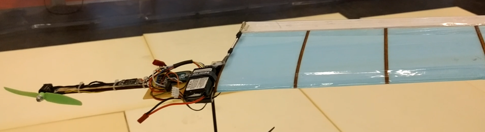

# Thetaflight
## Overview
Thetaflight is flight controller software (firmware) used to fly monocopters. Monocopters are a class of rotational craft that fly with one actuated wing and a motor. By varying the amount of lift of the wing by varying the angle of attack and camber of the wing, a 'virtual swashplate' is created allowing for controlled flight in the X, Y and Z planes. 

## Hardware:
* Control Board: Arduino Micro. This could be ported to several Arduino boards, but this implementation is specific to the Micro due to specific use of certain timers and interrupt pins.
* Compass sensor: HMC5883L. This compass sensor is overclocked in this implementation by re-initializing the sensor every time new data is available (DRDY interrupt). This allows polling of data at 160-170Hz instead of the normal maximum 75Hz.
* Receiver: FRSKY D4R-II in CPPM mode. Any CPPM receiver should work with my custom CPPM implementation.
* Servo: Savox SH-0262MG. I utilised an SH-0262MG due to its extremely low latency and fast movement as well as being able to handle >250Hz PWM comms rates.
* Motor and ESC: DYS SE1407 3600kv & Littlebee 20A. Any ESC that supports >250Hz PWM should suffice.
* An LED is utilised to show the virtual 'direction' that the craft is facing.

## Library:
Initially, many libraries were used however they quickly became obsolete in the face of the rising needs for compass and servo ppm overclock requirements (the default Arduino Servo library only supports 50Hz) as well as timer requirement overlaps. Furthermore, no decent CPPM library existed.
###Requirements:
Wire.h

## Update:
Version 2 is being worked on with better hardware and coding updates to follow.

## More Details:
A video of the first version can be seen here:

A detailed breakdown of the first version:
[FlopBot Version 1 PDF Breakdown](Flopbot_V01_-_Report.pdf)

## Wiring:
Pin | Usage | Purpose
------------ | ------------- | -------------
0 | (RX) | CPPM
2 | (SDL) | I2C
3 | (SCL) | I2C
7 | (DRDY) | HMC DRDY Interrupt
9 | (PWM) | Servo
10 | (PWM) | Motor
13 | (BIN) | LED

## Internal Timers:
Timer | bits | Prescaling | Type | TOP | Frequency | Usage
------------ | ------------- | ------------- | ------------- | ------------- | ------------- | -------------
0 | 8 | 64 | CTC | 77 | 3205 | LSM6 && ADXL
1A | 16 | 256 | Fast PWM | 999 | 250 | Servo PDM
1B | 16 | 256 | Fast PWM | 999 | 250 | Motor PDM

## Notes and Recommendations:
* If you are planning on building your own monocopter using an Arduino, I'd highly recommend using the Micro due to it's increased number of pins that can simultaneously utilise PWM outputs from internal timers whilst retaining so many interrupt pins after the use of I2C.
* Due to the implementation of CPPM, after roughly 75 Minutes the micros timer will overflow which will be perceived by the controller as erratic inputs.
* The RX pin (0) is used as an interrupt pin and therefore, the board needs to be reprogrammed with an external programmer (ISP).
* Helicopter tail servos generally support high frequencies, have low latencies, small amounts of slop and are very quick.
* If you have any questions regarding building your own monocopter, drop me a DM on [Twitter](https://twitter.com/CarlBeek)
